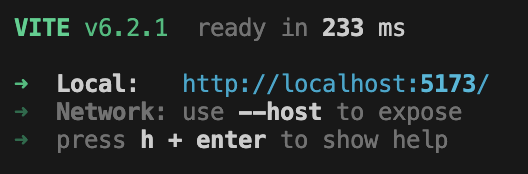
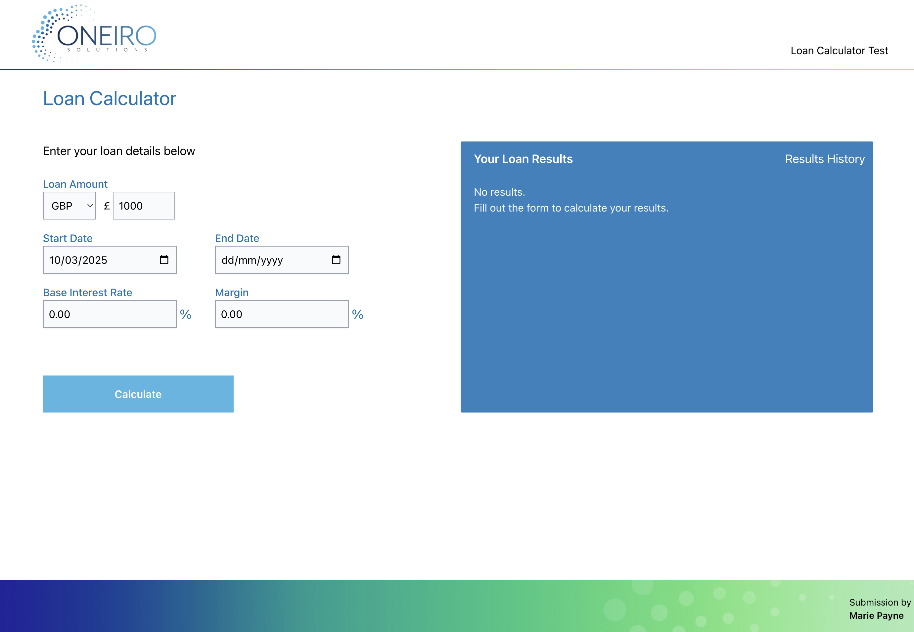
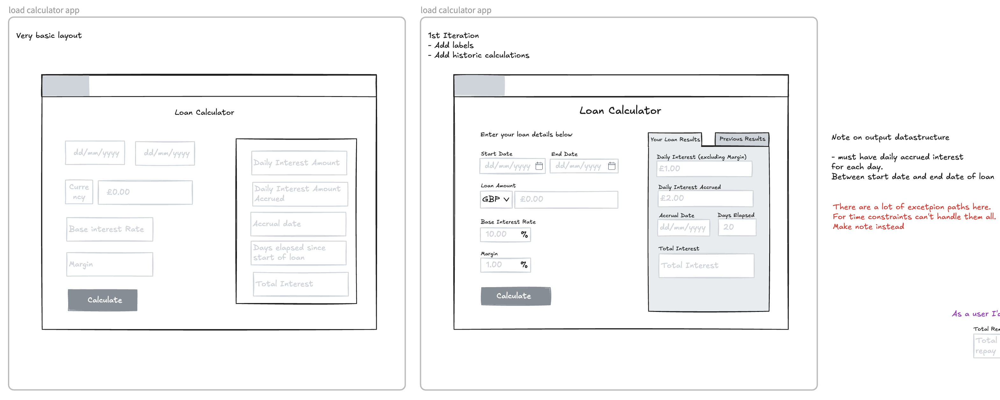

# Loan Calculator


## First time setup

You will need node lts and npm installed to run this.

Install dependencies

```sh
npm i
```

```sh
npm run dev
```



Go to localhost to run.

You should see the prototype running:



## Design Reference lofi wireframes:

